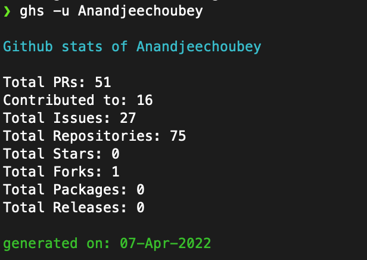
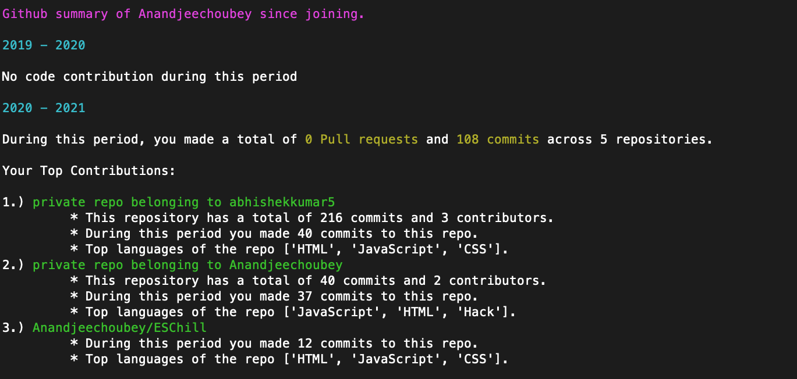
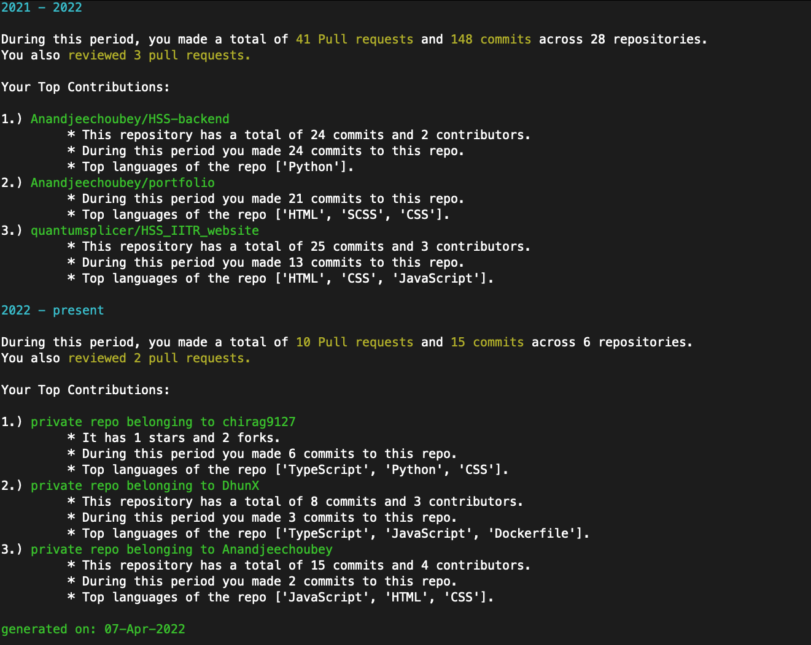

<h2> Hi there, This is <a href="https://anandjeechoubey.netlify.app/">Anand</a>  </h2>

- 🔭 I’m currently working on React, React Native, Node technologies
- 🌱 I’m currently learning Django, SQL and some DevOps stuff
- 💬 Ask me about anything related to webdev.
- 📫 How to reach me: [LinkedIn](https://www.linkedin.com/in/anand-jee-choubey/)
- 📩 Email me: [Gmail](mailto:anandjechoubey@gmail.com)
- 📜 Find my resume: [Resume](https://anandjeechoubey.netlify.app/assets/Resume.pdf)
- 😄 You can call me: Andy

<h2> My ghs:  </h2>

### 📊 Github Stats

